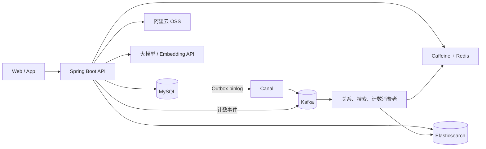

# 知光（ZhiGuang）——知识获取与分享平台

知光是一个面向知识内容发布、检索与互动的前后端分离项目。本仓库为后端，采用 Java 21 和 Spring Boot 构建，覆盖内容发布、首页 Feed、点赞收藏、用户关注、全文检索、RAG 问答和对象存储直传等功能。

项目以个人学习和简历展示为目的，重点实践双 JWT 会话管理、Outbox 事件链路、Redis 高并发计数、分层缓存和渐进式内容发布。当前形态是模块化单体，强调设计思路和关键链路的可验证性，不将其描述为已经过大规模生产流量验证的系统。

- 后端仓库：[G-Pegasus/zhiguang_be](https://github.com/G-Pegasus/zhiguang_be)
- 前端仓库：[G-Pegasus/zhiguang_fe](https://github.com/G-Pegasus/zhiguang_fe)
- 前端技术：React + Vite（前端页面使用 AI 辅助开发）

## 页面展示

<details>
<summary>展开查看前端页面截图</summary>

<p align="center">
  
  
</p>
<p align="center">
  
  
</p>
<p align="center">
  
  
</p>

</details>

## 主要功能

- 用户认证：验证码注册/登录、Access Token 刷新、退出登录、密码重置和当前用户查询。
- 知识发布：创建草稿、申请 OSS 预签名地址、前端直传、确认文件、补充元数据和正式发布。
- 内容互动：点赞、取消点赞、收藏、取消收藏，以及用户关注关系维护。
- 首页 Feed：公开内容分页、内容片段缓存、实时互动状态与计数叠加。
- 内容搜索：关键词检索、标签过滤、搜索联想、高亮和游标分页。
- AI 能力：内容摘要建议，以及围绕单篇公开知识内容的 RAG 流式问答。

## 技术栈

| 分类 | 技术 |
| --- | --- |
| 基础框架 | Java 21、Spring Boot 3.2、Spring Security、MyBatis |
| 数据存储 | MySQL、Redis、Caffeine、Elasticsearch、阿里云 OSS |
| 异步链路 | Kafka、Canal、Transactional Outbox |
| AI / RAG | Spring AI、DeepSeek、OpenAI 兼容 Embedding API、Vector Store |
| 工程能力 | Maven、Actuator、JUnit 5、Mockito |

## 整体架构



核心业务仍由同一个 Spring Boot 应用承载；Canal、Kafka、Elasticsearch、OSS 和模型服务用于扩展异步一致性、搜索、文件存储与 AI 能力。

## 核心设计

### 1. 双 JWT 认证

- 使用 RS256 签发 Access Token 和 Refresh Token，通过 `token_type` 区分用途。
- Access Token 默认有效期 15 分钟；Refresh Token 默认有效期 7 天。
- Refresh Token 的 `jti` 写入 Redis 白名单，刷新时轮换旧令牌；退出登录、密码重置时可撤销令牌。
- 私钥和本地 `application.yml` 不进入版本控制，仓库仅提供脱敏配置模板。

相关实现：[JwtService.java](src/main/java/com/tongji/auth/token/JwtService.java)、[RedisRefreshTokenStore.java](src/main/java/com/tongji/auth/token/RedisRefreshTokenStore.java)、[AuthService.java](src/main/java/com/tongji/auth/service/AuthService.java)

### 2. Outbox、Canal 与 Kafka 一致性链路

- 关注关系、内容发布/更新/删除与 Outbox 事件在同一数据库事务内写入，避免业务数据成功但事件缺失。
- Canal 订阅 Outbox 表的 binlog，并将事件转发到 Kafka。
- Canal 只有在当前批次的 Kafka 发送结果全部成功后才确认位点；发送失败时回滚批次，等待后续重试。
- 事件使用稳定业务键，保证同一关系或同一聚合根的消息进入同一 Kafka 分区并保持相对顺序。

这条链路采用“至少一次投递 + 下游幂等”的最终一致性语义，不声明跨 MySQL、Canal 与 Kafka 的 exactly-once。

相关实现：[OutboxEventWriter.java](src/main/java/com/tongji/relation/outbox/OutboxEventWriter.java)、[CanalKafkaBridge.java](src/main/java/com/tongji/relation/outbox/CanalKafkaBridge.java)

### 3. Redis Bitmap 点赞/收藏与压缩计数

- 点赞、收藏事实按用户 ID 写入分片 Bitmap，使用 Lua 完成幂等判断和原子状态切换。
- 互动事件异步写入 Kafka，消费者先聚合到 Redis Hash，再定时压缩为紧凑 SDS 计数结构。
- 正常读取优先使用压缩计数；发现计数缺失或投递失败标记时，按需对 Bitmap 执行 `BITCOUNT` 重建。
- Kafka 最终发送失败时记录带 TTL 的 dirty marker 并删除旧压缩值，使后续读取能够触发自愈，而不是长期返回旧计数。

该补偿用于个人项目中的轻量可靠性增强，并不等价于事务消息。若进程在 Bitmap 更新后、补偿标记写入前崩溃，仍可能存在短暂不一致窗口；更强保证可继续引入 Redis Stream 或可靠事件表。

相关实现：[CounterServiceImpl.java](src/main/java/com/tongji/counter/service/impl/CounterServiceImpl.java)、[CounterEventProducer.java](src/main/java/com/tongji/counter/event/CounterEventProducer.java)、[计数系统设计方案](docs/计数系统设计方案.md)

### 4. Feed 分层缓存

- 公开 Feed 使用 Caffeine 页面缓存、Redis ID 列表和 Redis 内容片段缓存；互动计数与当前用户的点赞/收藏状态在返回前实时叠加，避免把用户态写入公共缓存。
- 使用随机 TTL 抖动降低同一时刻大面积失效的概率，热点访问可触发缓存续租。
- JVM 内使用 single-flight 和锁内二次检查，减少同一实例中相同页面或详情的并发回源。
- 内容发布、更新、删除后主动清理本地页面缓存、Redis ID 列表和内容片段；事务提交后再执行一次失效，降低并发事务把旧值回填到缓存的风险。

single-flight 只协调当前 JVM。多实例之间没有广播 Caffeine 失效事件，其他实例依靠较短 TTL 收敛；如需进一步扩展，可接入 Redis Pub/Sub 或版本号缓存键。

相关实现：[KnowPostFeedServiceImpl.java](src/main/java/com/tongji/knowpost/service/impl/KnowPostFeedServiceImpl.java)、[KnowPostServiceImpl.java](src/main/java/com/tongji/knowpost/service/impl/KnowPostServiceImpl.java)

### 5. OSS 渐进式发布

内容发布被拆分为“创建草稿 → 获取 OSS 预签名地址 → 前端直传 → 后端确认文件 → 更新元数据 → 发布”。大文件不经过应用服务器转发，后端只保存对象键、ETag、大小、摘要和公开地址等元数据。

相关实现：[StorageController.java](src/main/java/com/tongji/storage/api/StorageController.java)、[OssStorageService.java](src/main/java/com/tongji/storage/OssStorageService.java)、[KnowPostController.java](src/main/java/com/tongji/knowpost/api/KnowPostController.java)

### 6. Elasticsearch 搜索与 RAG 问答

- 搜索使用 `multi_match` 召回标题和正文，通过 `function_score` 融合相关性与互动数据权重。
- 使用 `search_after` 进行游标分页，使用 Completion Suggester 提供标题前缀联想。
- RAG 仅索引公开且已发布的内容；从 OSS 获取 Markdown，分块后写入向量存储，并通过内容指纹避免无效重复索引。
- 单篇内容问答通过 SSE 流式返回生成结果。

Elasticsearch 索引映射使用 IK 分词器，启用搜索功能前需在 Elasticsearch 安装兼容版本的 IK 插件。

相关实现：[SearchServiceImpl.java](src/main/java/com/tongji/search/service/impl/SearchServiceImpl.java)、[RagIndexService.java](src/main/java/com/tongji/llm/rag/RagIndexService.java)、[KnowPostRagController.java](src/main/java/com/tongji/knowpost/api/KnowPostRagController.java)

## 近期可靠性改造

| 改造内容 | 解决的问题 |
| --- | --- |
| 提供脱敏配置模板并忽略本地配置/私钥 | 防止个人数据库密码、OSS 密钥、模型 API Key 和 JWT 私钥继续被 Git 跟踪，同时保留可复制的启动配置。 |
| 业务写入与 Outbox 写入共用事务 | Outbox 序列化或插入失败时不再吞异常，避免业务数据已提交但事件永久丢失。 |
| Canal 等待 Kafka 发送结果后再 ACK | 避免 Kafka 异步发送失败但 Canal 位点已经前移；稳定业务键同时改善同一实体事件的分区顺序。 |
| single-flight 使用 `finally` 清理 | 回源、Redis 或数据库异常后也能移除锁对象，避免失败键永久残留和后续请求持续复用无效状态。 |
| Feed 写路径统一失效本地与 Redis 缓存 | 修复内容变更后首页仍读取旧 ID 列表/旧内容片段，以及列表重建时重复追加 ID 的问题。 |
| 计数事件发送失败后标脏并按需重建 | 避免 Bitmap 已更新但 Kafka 事件最终失败时，压缩计数长期停留在旧值。 |

对应测试覆盖了 JWT 类型校验、热点续租、Outbox 失败回滚、Canal ACK/rollback、single-flight 异常清理、Feed Redis 失效和计数失败补偿等关键分支。

## 项目结构

```text
src/main/java/com/tongji
├─ auth/          # 认证、令牌与登录审计
├─ cache/         # Caffeine、热点检测与缓存配置
├─ counter/       # Bitmap、Lua、Kafka 聚合与计数重建
├─ knowpost/      # 草稿、发布、Feed 和内容详情
├─ relation/      # 关注关系、Outbox、Canal-Kafka 桥接
├─ search/        # Elasticsearch 索引、检索与联想
├─ storage/       # OSS 预签名与对象元数据
├─ llm/           # 摘要生成与 RAG
├─ profile/       # 用户资料
└─ common/        # 通用响应、异常与基础能力
```

## 本地运行

### 1. 环境要求

基础功能至少需要：

- JDK 21
- Maven 3.9+
- MySQL 8.x
- Redis 6+
- Kafka

完整体验还需要 Canal、Elasticsearch（含 IK 插件）、阿里云 OSS，以及可用的聊天模型和 Embedding API。未准备 Canal 时可设置 `CANAL_ENABLED=false`，先运行不依赖 Canal 链路的功能。

### 2. 初始化数据库

先创建数据库，再执行仓库中的建表脚本：

```sql
CREATE DATABASE zhiguang CHARACTER SET utf8mb4 COLLATE utf8mb4_unicode_ci;
```

```bash
mysql -u root -p zhiguang < db/schema.sql
```

### 3. 创建本地配置

Windows PowerShell：

```powershell
Copy-Item src/main/resources/application-example.yml src/main/resources/application.yml
```

macOS / Linux：

```bash
cp src/main/resources/application-example.yml src/main/resources/application.yml
```

`application.yml` 已被 `.gitignore` 忽略。请在本地文件或环境变量中填写真实配置，不要提交数据库密码、OSS 密钥、模型 API Key 或 JWT 私钥。

常用环境变量：

| 配置 | 环境变量 |
| --- | --- |
| MySQL | `DB_URL`、`DB_USERNAME`、`DB_PASSWORD` |
| Redis | `REDIS_HOST`、`REDIS_PORT` |
| Kafka | `KAFKA_BOOTSTRAP_SERVERS` |
| Canal | `CANAL_ENABLED`、`CANAL_HOST`、`CANAL_PORT`、`CANAL_DESTINATION` |
| JWT | `JWT_PRIVATE_KEY`、`JWT_PUBLIC_KEY` |
| OSS | `OSS_ENDPOINT`、`OSS_ACCESS_KEY_ID`、`OSS_ACCESS_KEY_SECRET`、`OSS_BUCKET`、`OSS_PUBLIC_DOMAIN` |
| AI | `DEEPSEEK_API_KEY`、`OPENAI_API_KEY`、`OPENAI_BASE_URL` |

JWT 使用一对匹配的 RSA 密钥。私钥应保存于仓库外，或放入已忽略的 `src/main/resources/keys/private.pem`；公钥使用 X.509 PEM，私钥使用 PKCS#8 PEM。配置值支持 Spring Resource 写法，例如 `file:C:/keys/private.pem`。

### 4. 启动应用

```bash
mvn spring-boot:run
```

默认端口和各中间件参数以 [application-example.yml](src/main/resources/application-example.yml) 为准。

## 测试

```bash
mvn test
```

当前测试重点覆盖本轮可靠性改造涉及的关键分支。外部中间件的完整联调仍需要在本地准备对应服务和配置。

## 接口与设计文档

- [通用 API 接口](docs/API接口.md)
- [知识内容 API](docs/API接口文档_knowpost.md)
- [计数 API](docs/API接口文档_计数.md)
- [用户关系 API](docs/API接口文档_用户关系.md)
- [计数系统设计方案](docs/计数系统设计方案.md)
- [用户关系设计方案](docs/用户关系设计方案.md)

## 已知边界

- Outbox 链路提供至少一次投递，消费者仍需保留幂等或去重能力。
- Feed 的 single-flight 与 Caffeine 缓存均为 JVM 本地能力，多实例一致性依赖 Redis 失效、短 TTL 或后续广播机制。
- 计数发送失败补偿是按需自愈方案，不是严格的事务消息实现。
- Bitmap 全量重建和部分聚合巡检仍包含键扫描逻辑；数据规模扩大后应改为显式索引集合或离线任务。
- 本项目没有经过生产级容量压测，不对吞吐量、可用性等级或故障恢复时间作未经验证的承诺。
